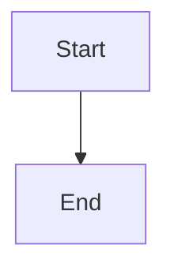

## Introduction

This section introduces the topic.

### Background

Some background detail.

## Code Example

```typescript
function greet(name: string): string {
  return `Hello, ${name}!`;
}
```

## Math

Inline math: $E = mc^2$

Block math:

$$
\int_0^\infty e^{-x^2} dx = \frac{\sqrt{\pi}}{2}
$$

## Diagram



## Table

| Name | Value |
|------|-------|
| foo  | 1     |
| bar  | 2     |
